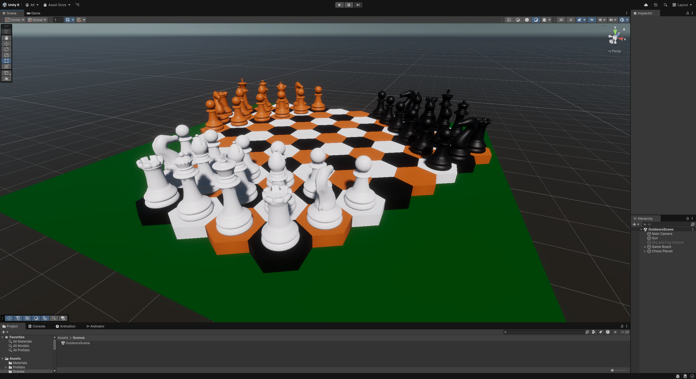
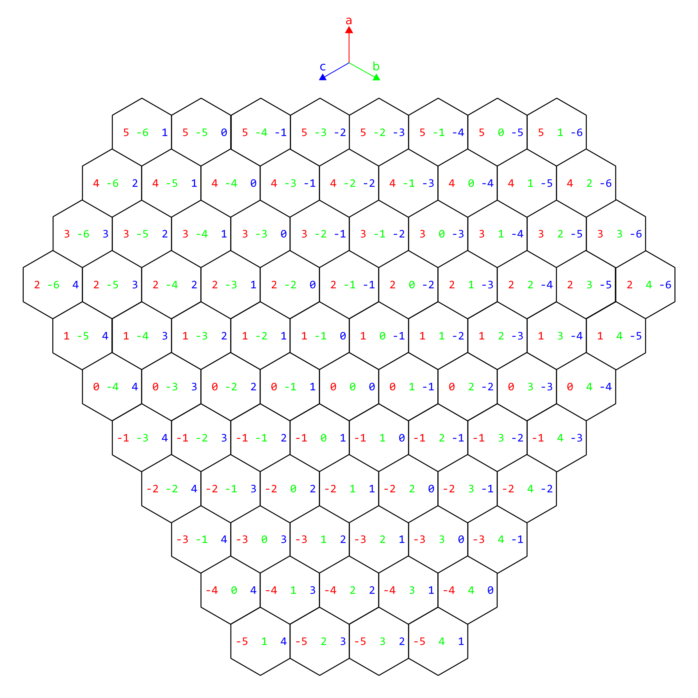

# 🏆 TriChess - A Three-Player Chess Game  

TriChess is an innovative three-player chess game built in Unity. It expands on traditional chess by introducing a triangular board and modified chess movement rules to fit three players.  

## 🎮 Features  

- **Three-Player Chess** – Play against two opponents in a three player chess game.
- **Triangular Chessboard** – A fresh take on the classic game with a unique board layout.  
- **Custom Piece Movements** – Adjusted movement rules to fit the triangular board. 

## 📸 Pictures  
**Game starting layout:**

**Used cube coordinates:**

### 🛠️ Current Development Stage  

#### Current Status:  
- **Chessboard & Pieces**: The triangular chessboard tiles have been made and saved inside tileMap dictionary (Cube coordinates as keys, tiles as values).
  
#### To do:
- Create chess pieces and save them inside appropriate data structures with cube coordinates.
- Enable player interaction with pieces (drag and drop or click-to-move functionality).
- Implement movement rules based on the triangular board layout.
- Add turn-based mechanics, including player switching and move validation.
- Integrate win conditions (checkmate, stalemate, etc.).